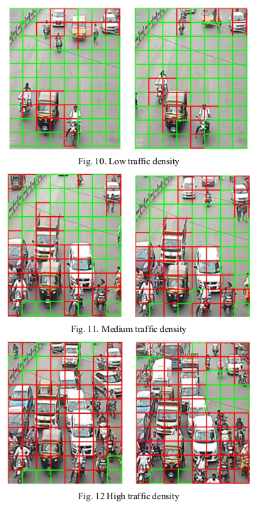

# Smart-Traffic-Junction

This repository contains the working implementation of our research paper [link](https://arxiv.org/abs/2005.01770). The paper was presented and published at IEEE PuneCon 19 conference. We propose a simple algorithm for traffic density estimation using image processing and machine learning.

> **HOG, LBP and SVM based Traffic Density Estimation at Intersection** 
> [Devashish Prasad](https://github.com/DevashishPrasad),
> [Ayan Gadpal](https://github.com/ayangadpal),
> [Kshitij Kapadni](https://github.com/kshitijkapadni),
> [Manish Visave](https://github.com/ManishDV),
>  

## Dataset

The dataset was created using <a href="http://www.eecs.qmul.ac.uk/~sgg/QMUL_Junction_Datasets/Junction2/Junction2.html">QMUL junction 2</a> video. We manually sorted the rois of the <a href="dataset.zip">dataset</a>.

## Algorithm

Please go through our paper paper [link](https://arxiv.org/abs/2005.01770).

## Results of the traffic density algorithm

## System Architecture

## Video Demo 
[Smart management](https://youtu.be/_VRbJYt-MtU) and [Remote monitoring](https://youtu.be/D08sR8rcMhg)

## Files in this repo
1) save_rois.py : saves ROIs (small blocks of image) from the QMUL junction 2 video  
2) save_HOG_LBP.py : saves the HOG(Histogram of Oriented Gradients) and LBP(Local Binary Pattern) features into pickle file
3) classifier.py : trains the SVM classifier and saves the model into pickle
4) predictor.py : reads the video and predicts the output on the image

## Contact
Devashish Prasad : devashishkprasad [at] gmail [dot] com  
Ayan Gadpal : ayangadpal2 [at] gmail [dot] com  
Kshitij Kapadni : kshitij.kapadni [at] gmail [dot] com  
Manish Visave : manishvisave149 [at] gmail [dot] com  
